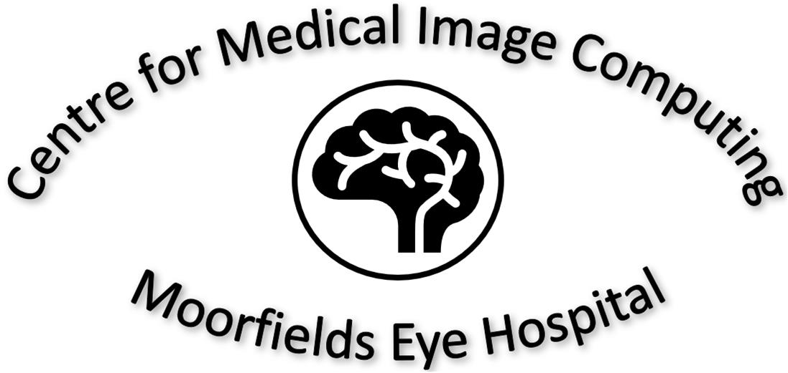
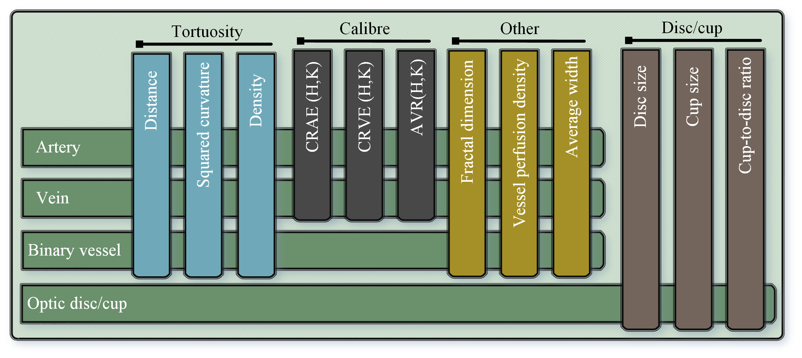

# AutoMorph 👀

Automated Retinal Vascular Morphology Quantification via a Deep Learning Pipeline
[[paper](https://www.medrxiv.org/content/10.1101/2022.05.26.22274795v1.full.pdf)][[code](https://github.com/rmaphoh/AutoMorph)]

### Brief
AutoMorph includes four modules, the retinal image preprocessing, image quality grading, anatomical segmentation (vessel, artery/vein, optic disc/cup), and clinically-relevant feature measurement. AutoMorph can be applied for **data curation**, **segmentation task**, and **clinical correlation research**, such as '[oculomics](https://tvst.arvojournals.org/article.aspx?articleid=2761238)'. AutoMorph has been externally validated on public datasets and now deployed in large-scale clinical research with [UK BioBank](https://www.ukbiobank.ac.uk/) and [AlzEye](https://readingcentre.org/workstreams/artificial_intelligence_hub/alzeye/).

### Usage
Three options to run AutoMorph: 
1) Google Colab
2) configure enviroment on local/virtual machine 
3) Docker image. 

More details can be referred to [Github page](https://github.com/rmaphoh/AutoMorph).

### Contributing
Being involved in AutoMorph from any of following points:

* Improvement on code structure, formating or document
* Suggestions to improve user experience
* Adding deep learning baselines
* etc.

### Collaboration
Potential collaboration is warmly welcomed. It includes but not limited to AutoMorph deployment, cross validation, and technique upgrade. Please contact with the senior authors or first author.

